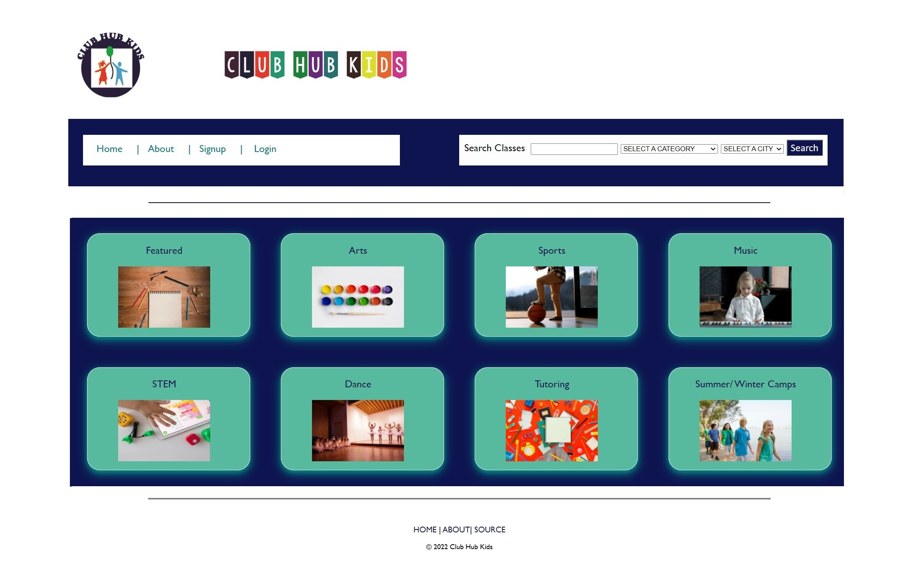
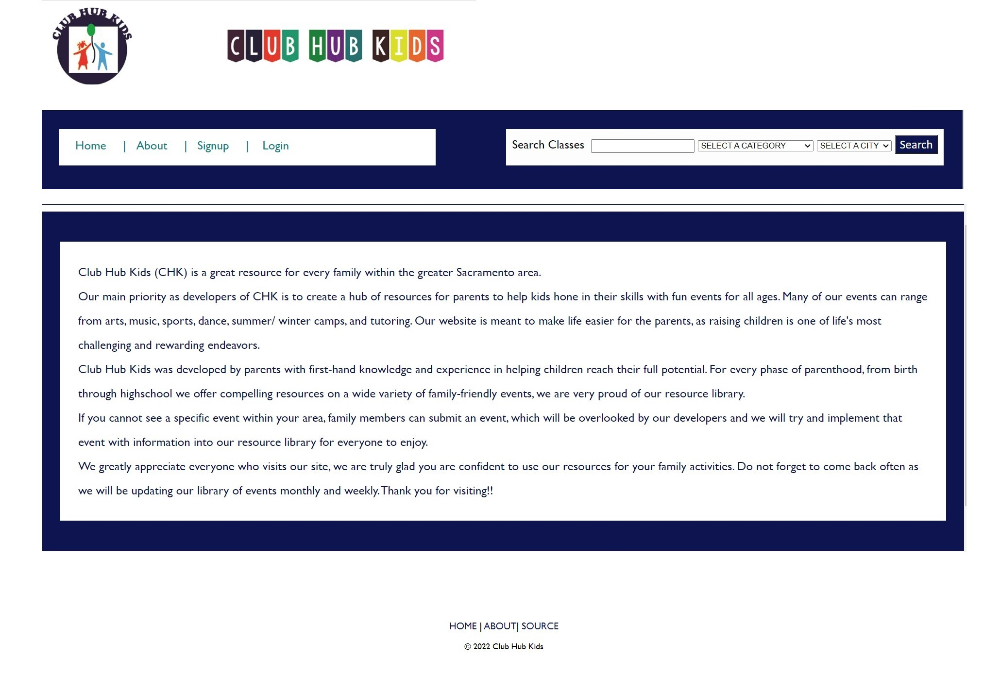
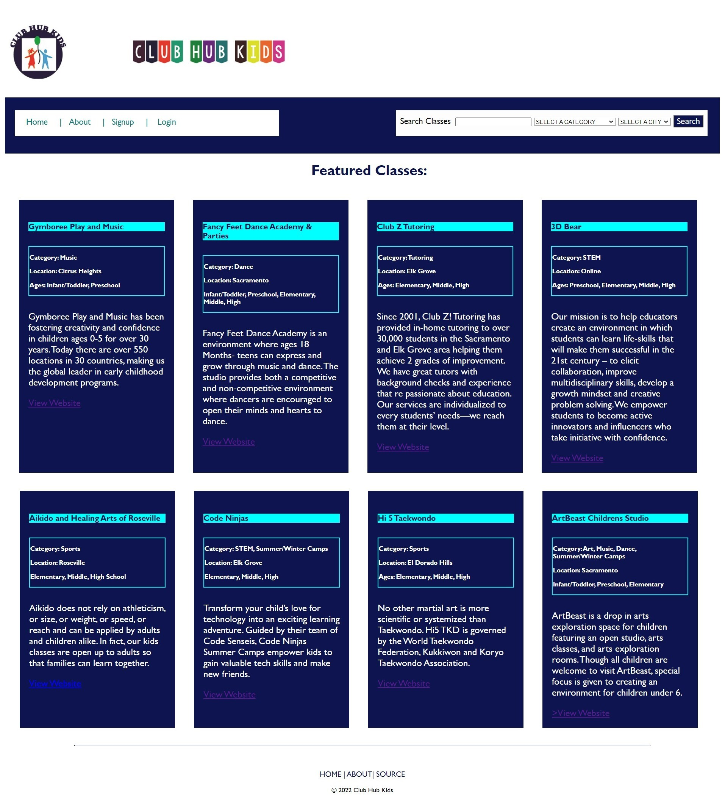

# CLUB HUB KIDS
​
Club Hub Kids was developed by parents with first-hand knowledge and experience in helping children reach their full potential. For every phase of parenthood, from birth through high school we offer compelling resources on a wide variety of family-friendly events, we are very proud of our resource library. 
​
## User Story
​
As a parent
I want to be able to find classes and camps appropriate for my child
When I filter by category, I am shown classes only in that category
When I filter by location, I am shown classes only in that location
When I signup, I will have access to an account where I can store registrations and share events with other local parents/caregivers/service providers.
 
​
## Technologies:
​
- Express
- express-handlebars
- mysql
- sequelize
- JavaScript
- Html
- CSS
- Bootstrap
​
## Installation:
​
npm install
​
​
### Links
​
GitHub Repo: https://github.com/nelsonRoberts1968/after_school/tree/main

Heroku Deployed:https://clubhubkids.herokuapp.com/
​
## Website Homepage
​

## About US Page
​

## Feature Page for Service Providers
​

## Users Signup Page
​

​
## License:
​
Copyright (c) Nelson Roberts, Neda Parvini, Maggie Finnegan, John Enriquez Perez.
​
All rights reserved.
​
Licensed under the MIT license.
